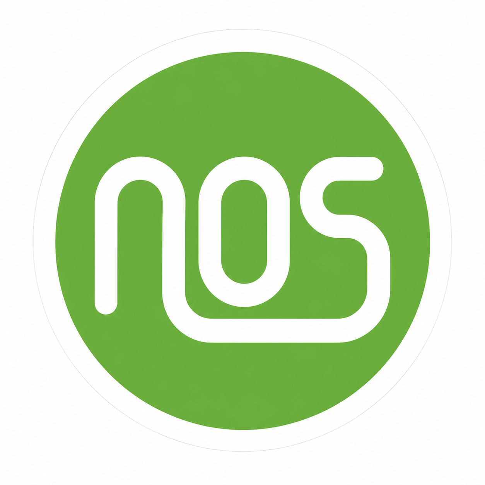

<p align="center">
  
</p>

<h1 align="center">Naabiga OS (N-OS)</h1>

<p align="center">
  <strong>La distribution Linux des développeurs, pensée en Afrique et ouverte au monde.</strong><br>
  <em>Build Faster. Create Smarter.</em>
</p>

<p align="center">
  <a href="https://github.com/princebilogocode/naabiga-os/actions/workflows/ci.yml"></a>
  <a href="LICENSE"></a>
  
  
  
  
</p>

---

## Qu'est-ce que Naabiga OS ?

**Naabiga OS est le premier système d'exploitation conçu par des Burkinabè, pour les Burkinabè et pour l'Afrique.** Une fierté nationale portée par ICONEDOR et les étudiants de l'Université Aube Nouvelle de Bobo-Dioulasso.

**Naabiga OS** (abrégé **N-OS** ou **NOS**) est un système d'exploitation Linux à support long terme (LTS), conçu pour qu'un développeur puisse **installer son système et commencer à coder en moins de 5 minutes**.

N-OS ne réinvente pas Linux. Le projet construit sur un socle Linux LTS éprouvé une couche cohérente d'outils, d'intégration et de qualité : SDK préinstallés, diagnostic automatique, gestionnaire de versions, assistants IA, bureau Cinnamon personnalisé et expérience **francophone par défaut**.

N-OS fait partie de l'écosystème **[NAABIGA](branding/charte-graphique-naabiga.md)**, un ensemble de services numériques africains (AI, Store, Cloud, Pay, Maps, Docs, OS…).

## Développé par

**ICONEDOR** (Burkina Faso), en collaboration avec les étudiants de **l'Université Aube Nouvelle (U-AUBEN), Bobo-Dioulasso**.

Voir [AUTHORS.md](AUTHORS.md) et le [guide de contribution](CONTRIBUTING.md).

## Pour qui ?

| Public | Ce que N-OS apporte |
|---|---|
| Développeurs Flutter / Android | Android Studio, Android SDK, Flutter, Dart, Java 17, adb, fastboot prêts à l'emploi |
| Développeurs Web | Node.js LTS, pnpm, Yarn, PHP, Composer, Nginx, Playwright, Chrome, Firefox |
| Développeurs IA | Claude Code, Gemini CLI, Ollama, Aider, Continue, OpenCode |
| DevOps | Docker, Docker Compose, Git, OpenSSH, Rust, Go, CMake |
| Étudiants et universités | Installation simple, tout inclus, documentation en français |
| Entreprises | Base LTS stable, sécurité activée par défaut, déploiement de parc |
| **Bureautique** | LibreOffice complet en français, polices compatibles Office, PDF/OCR, courriel, scanner, imprimante (`nos profile apply bureautique`) |
| **Enseignement supérieur** | LaTeX, Jupyter, R, Octave, GeoGebra, Zotero, Veyon et mode salle de TP (`nos profile apply education`) |
| **Administration** | Poste durci, sauvegardes, antivirus, Active Directory, inventaire de parc (`nos profile apply administration`) |

## Applications exclusives

| Application | Rôle | Commande |
|---|---|---|
| **N-OS CLI** | Point d'entrée unique de l'écosystème | `nos` |
| **N-OS Doctor** | Diagnostic et réparation de l'environnement de dev | `nos doctor` |
| **N-OS SDK Manager** | Gestion multi-versions de Flutter, Java, Node.js, Android SDK | `nos sdk` |
| **N-OS AI Hub** | Installation et gestion des assistants IA | `nos ai` |
| **Profils d'usage** | Développement, bureautique, enseignement supérieur, administration | `nos profile` |
| **N-OS Center** | Centre logiciel graphique (Flutter Desktop) | `nos-center` |

```bash
nos doctor            # Diagnostic complet (Flutter, Android, Java, Docker, Node, Python, Git, PATH…)
nos doctor --repair   # Réparation automatique
nos doctor --json     # Export JSON
nos doctor --export   # Rapport HTML
nos install flutter   # Installer un outil du catalogue
nos sdk list          # Lister les SDK et versions
nos ai install claude # Installer un assistant IA
nos profile apply education  # Poste d'enseignement supérieur (LaTeX, Jupyter, R, salle de TP)
nos update            # Mettre à jour le système et les outils N-OS
nos info              # Informations système
```

## Démarrage rapide

### Essayer la CLI sans installer N-OS (sur toute distribution à base Debian)

```bash
git clone https://github.com/princebilogocode/naabiga-os.git
cd naabiga-os
sudo make install-cli
nos doctor
```

### Construire l'ISO

```bash
sudo apt install live-build debootstrap xorriso squashfs-tools
sudo make iso
# Résultat : build/out/naabiga-os-<version>-amd64.iso
```

Voir [docs/handbook/build-iso.md](docs/handbook/build-iso.md).

### Lancer les tests

```bash
make test
```

## Organisation du dépôt

```text
naabiga-os/
├── docs/          Documentation (MkDocs Material) : vision, architecture, desktop, installer, packaging, security, qa, roadmap, handbook
├── branding/      Logo, charte graphique, palette, fonds d'écran
├── build/         Scripts de construction (ISO, paquets)
├── iso/           Configuration live-build (listes de paquets, hooks, fichiers inclus)
├── packages/      Métadonnées des paquets .deb N-OS (nos-base, nos-branding, nos-cli, nos-desktop)
├── desktop/       Personnalisation Cinnamon (dconf, thème, icônes, Plymouth, GRUB)
├── installer/     Configuration Calamares
├── apps/          nos-cli, nos-doctor, nos-sdk, nos-ai, nos-center
├── scripts/       Optimisations système, premier démarrage, installation des outils
├── tests/         Tests unitaires (bats) et d'intégration
└── .github/       CI/CD, templates d'issues et de PR
```

## Architecture

```text
Noyau Linux → Socle LTS → N-OS Core → N-OS Desktop → N-OS Developer Platform → Applications N-OS
```

Décisions clés : socle Linux LTS (support 5 ans), Cinnamon, Calamares, APT + Flatpak (pas de Snap par défaut), MkDocs Material, Flutter Desktop pour N-OS Center, Bash puis Rust pour les outils système.

Détails : [docs/architecture/](docs/architecture/).

## Roadmap

| Phase | Contenu | État |
|---|---|---|
| **Alpha** | Branding, ISO minimale, installateur, CLI et Doctor | 🚧 en cours |
| **Beta** | N-OS Center, SDK Manager, AI Hub, dépôts de test | ⏳ |
| **RC** | Dépôts officiels, documentation complète, tests matériels | ⏳ |
| **1.0 LTS** | Première version stable, support long terme | ⏳ |

Roadmap détaillée : [docs/roadmap/roadmap.md](docs/roadmap/roadmap.md).

## Sécurité et secrets

Aucune clé, jeton ou mot de passe n'est versionné : `.gitignore` renforcé, scanner `scripts/check-secrets.sh` dans `make lint`, hook pre-commit (`make hooks`) et Gitleaks en CI. Voir [SECURITY.md](SECURITY.md) et [docs/security](docs/security/index.md).

## Contribuer

Les contributions sont les bienvenues, en particulier de la part des étudiants de l'U-AUBEN. Lisez [CONTRIBUTING.md](CONTRIBUTING.md) (GitFlow, Conventional Commits, revue obligatoire) et le [Code de conduite](CODE_OF_CONDUCT.md).

## Licence

- Applications et scripts N-OS : **GPL-3.0** (voir [LICENSE](LICENSE)).
- Le nom « Naabiga », le logo et la charte graphique sont la propriété d'ICONEDOR (voir [branding/README.md](branding/README.md)).

---

<p align="center"><em>Fait au Burkina Faso, pour l'Afrique. Built in Africa. Ready for the World.</em></p>
