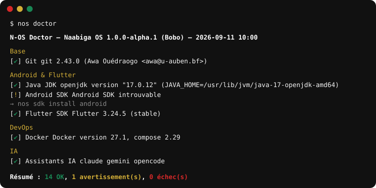

# Démarrer avec Naabiga OS

## 1. Obtenir N-OS

=== "ISO (installation complète)"

    1. Téléchargez `naabiga-os-<version>-amd64.iso` et son `.sha256` depuis les [releases GitHub](https://github.com/princebilogocode/naabiga-os/releases).
    2. Vérifiez l'intégrité :
       ```bash
       sha256sum -c naabiga-os-*.iso.sha256
       ```
    3. Écrivez l'image sur une clé USB (8 Go minimum) avec [balenaEtcher](https://etcher.balena.io/), Ventoy ou :
       ```bash
       sudo dd if=naabiga-os-*.iso of=/dev/sdX bs=4M status=progress oflag=sync
       ```
    4. Démarrez sur la clé (BIOS ou UEFI, Secure Boot supporté), essayez la session live, puis cliquez sur **Installer Naabiga OS**.

=== "CLI seule (sur un système à base Debian existant)"

    ```bash
    git clone https://github.com/princebilogocode/naabiga-os.git
    cd naabiga-os
    sudo make install-cli
    nos doctor
    ```

## 2. Installation (Calamares)

- Langue : **français** par défaut, autres langues disponibles.
- Disposition clavier : française par défaut.
- Partitionnement : « Effacer le disque » (ext4) avec case **Chiffrer le système** (LUKS2), ou manuel.
- Utilisateur : ajouté automatiquement aux groupes `sudo`, `docker`, `kvm`, `dialout`, `plugdev`.
- Durée : 10 à 20 minutes selon le disque.

## 3. Premier démarrage

Le service `nos-first-boot` applique une seule fois : ZRAM, TRIM, optimisation SSD, démarrage rapide, Docker, Flutter, Android Studio (KVM, Gradle), locale, groupes, pare-feu UFW, Flathub. Journal : `/var/log/nos-first-boot.log`.

## 4. Vérifier son environnement

```bash
nos doctor
```



Tout est vert ? Vous pouvez développer. Sinon :

```bash
nos doctor --repair
```

## 5. Installer ce qui manque

```bash
nos install --list            # catalogue
nos install android-studio    # ~1 Go, non inclus dans l'ISO
nos ai install claude         # assistant IA
nos sdk install java 21       # une autre version de Java
nos sdk use java 21
```

## 6. Raccourcis utiles

| Raccourci | Action |
|---|---|
| `Ctrl+Alt+T` | Terminal |
| `Super+E` | Fichiers |
| `Super+D` | N-OS Doctor |

## 7. Obtenir de l'aide

- `nos help`, `nos <commande> --help`
- [Issues GitHub](https://github.com/princebilogocode/naabiga-os/issues)
- Rapport à joindre à une demande d'aide : `nos doctor --export rapport.html`
